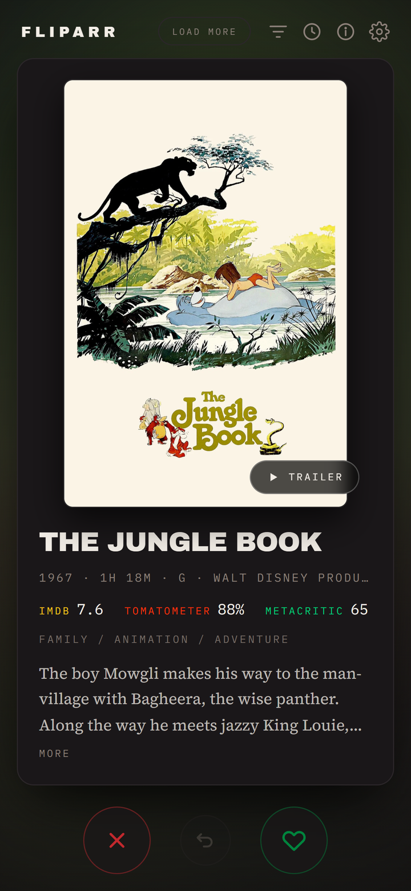
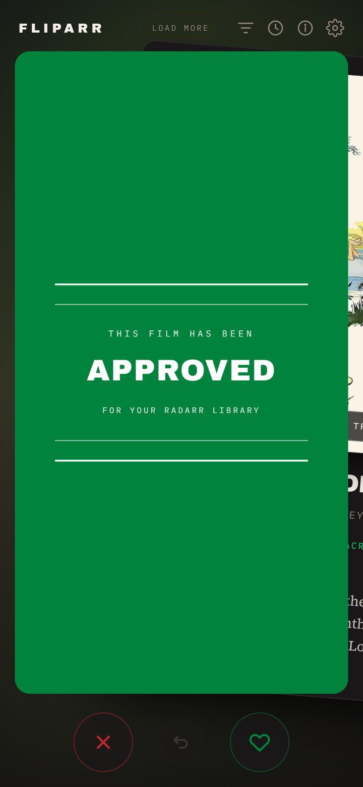
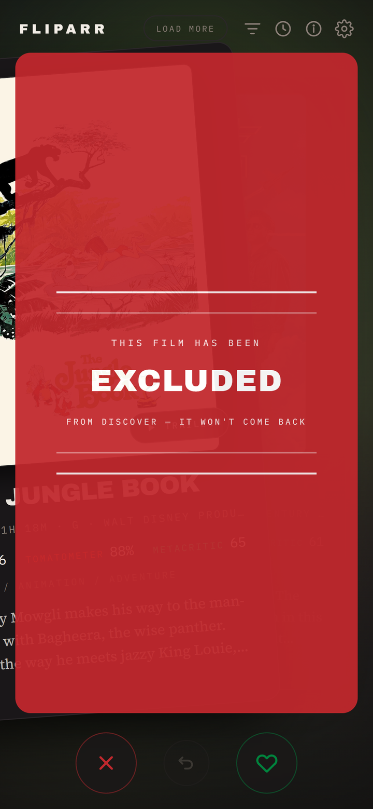
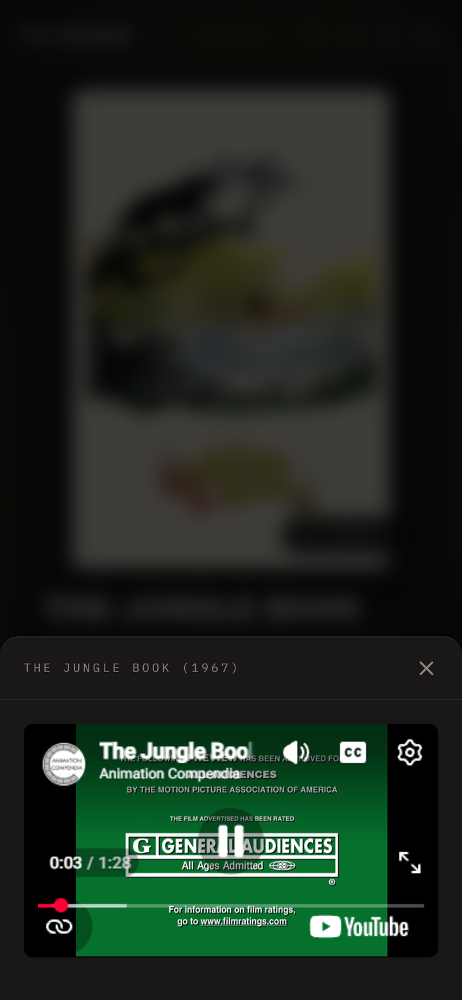
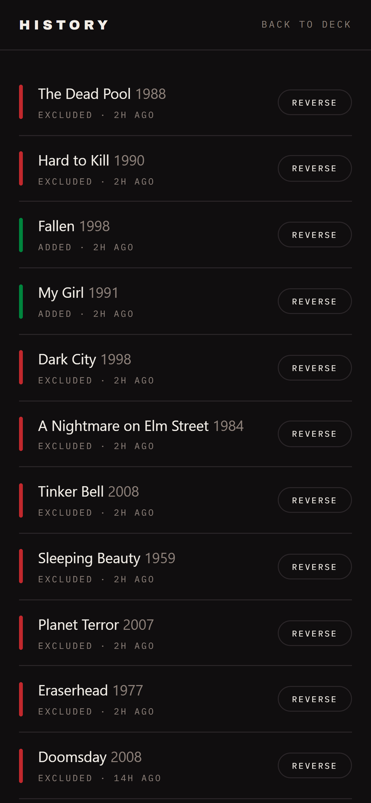
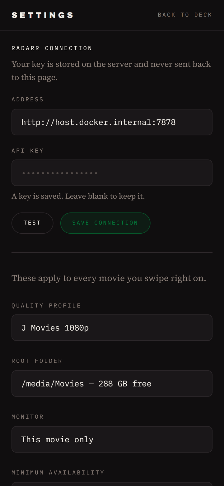

<div align="center">

# Fliparr

### Tinder-style swiping for your Radarr & Seerr queue — movies *and* TV

**Swipe right to add or request, left to pass.** Movies from Radarr's
recommendations or Seerr's endless discover; **TV from Seerr**. A self-hosted
discovery app for your homelab, built for your phone.

[](https://www.gnu.org/licenses/gpl-3.0)




</div>

---

## What is Fliparr?

Finding things to add to your library is a wall of text — Radarr's Discover tab,
Seerr's grid — every title a few taps to add, request, or dismiss, with no fast
way to work through hundreds of them.

Fliparr turns that into a deck of cards. One title fills your phone screen —
poster, ratings, genres, synopsis, trailer — and you decide with a swipe. It
covers **movies and TV**, sourced from **Radarr** and **Seerr**.

| Gesture | Radarr movie | Seerr movie / TV |
| --- | --- | --- |
| **Swipe right** | Added to your library, monitored, release search starts | Files a Seerr request (Seerr routes it on to Radarr / Sonarr) |
| **Swipe left** | Written to **Import List Exclusions** — never comes back | Skips the card (Seerr has no exclusion list) |
| **Undo** | Reverses the last action, up to 50 deep | Cancels the request, or un-skips |

Unlike "what should we watch tonight" apps, Fliparr is a **library curation
tool**. It decides what *enters* your collection, not what you play next.

---

## Features

### Swipe to decide

Drag the card and a verdict card takes over the screen, styled after the green
and red band cards that open theatrical trailers. Release past the threshold to
commit; let go early and it snaps back.

<div align="center">


</div>

### Watch the trailer without leaving the deck

Tap **Trailer** and it plays in a sheet over the deck. Radarr already supplies a
YouTube ID with the recommendation, so there is no extra lookup and no API key
to configure.

<div align="center">

</div>

### Movies and TV, blended or on their own

A **Movies / TV / Both** toggle sits under the header. **Both** interleaves the
two into one deck. Movies come from your chosen source — Radarr's library-derived
recommendations, Seerr's endless discover, or **both blended together**; **TV
comes from Seerr** (Overseerr / Jellyseerr), because Sonarr has no recommendation
feed to swipe.

Every card carries its own origin, so a single mixed deck routes each swipe to
the right place on its own: a Radarr movie is *added* / *excluded*, a Seerr movie
or show is *requested* / *skipped* — the buttons and the drag verdict change to
match the card. If one source is down, its cards are simply absent; the deck
still fills from the others.

**Tell them apart at a glance:** movie and TV cards each carry a coloured badge
and a matching backdrop tint (amber and teal by default, both configurable in
Settings), so a blended deck never leaves you guessing what you're swiping.

### Filter by genre and rating

Optional and off by default. Every genre in the current deck with a live count;
picking several widens the deck rather than narrowing it, so **Horror +
Thriller** shows either. Add a **minimum rating** gate — IMDb, Rotten Tomatoes,
Metacritic, or TMDB — to skim only the good stuff.

<div align="center">

</div>

### Reversible history

Every swipe is recorded with what you decided and when, and each one can be
reversed on its own — a mistake twenty cards back is one tap, not twenty.

<div align="center">

</div>

### Connect and configure in the app

Radarr's address and API key are set in Settings with a **Test** button, so a
typo surfaces immediately instead of as a failed swipe later. Quality profile,
root folder, monitor mode, minimum availability, and search-on-add are read
live from your Radarr.

<div align="center">

</div>

### Also

- **Keyboard shortcuts** on desktop — `←` exclude, `→` add, `U` undo
- **Ratings at a glance** from IMDb, Rotten Tomatoes, and Metacritic, each in
  its own colour
- **Mobile-first** dark interface designed for a phone in a dark room
- **No login, no account, no telemetry** — it talks to your own services and nothing else

---

## The deck refills itself

This is the part worth understanding, because it is why the queue never runs dry.

**From Radarr**, recommendations come from a live SQL query over every movie you
own, subtracting your library and your exclusion list, capped at the top 100 and
ranked by how many of your own films recommend each candidate. The candidate
pool is far larger than 100 — **every swipe frees a slot and promotes the
next-best candidate into it**, so it keeps producing new material rather than
draining to zero.

**From Seerr**, the movie and TV discover feeds are hundreds of pages of TMDB
popular titles — effectively bottomless. Fliparr accumulates them page by page as
you swipe.

Either way, Fliparr pulls more automatically once you drop below 15 cards, and
the **Load more** button does it on demand.

---

## Requirements

- **Radarr v3 API** — developed and tested against Radarr **6.3.0**. Needed for
  the Radarr movie source; some movies already in your library, since
  recommendations are derived from what you own.
- **Overseerr or Jellyseerr** (a "Seerr") — **required for TV**, and optional as
  an endless movie source. Tested against Overseerr **3.4**. TV requests route
  through Seerr to Sonarr under Seerr's own profiles.
- At least one of the two above. Movies can come from either; TV needs Seerr.
- **Docker** (recommended) or **Node.js 20.9+** for a local install
- API keys: *Radarr → Settings → General → API Key* and/or
  *Seerr → Settings → General → API Key*

---

## Installation

### Docker (recommended)

```bash
docker run -d \
  --name fliparr \
  --restart unless-stopped \
  -p 7979:3000 \
  --add-host host.docker.internal:host-gateway \
  -e RADARR_URL=http://host.docker.internal:7878 \
  -e RADARR_API_KEY=your_api_key_here \
  -v /path/to/appdata/fliparr:/config \
  jamisonfitz/fliparr:latest
```

Then open `http://your-server:7979`.

> **Point `RADARR_URL` at `host.docker.internal`, not your host's LAN IP.**
> When Radarr runs on the same machine, the LAN IP makes the request leave the
> bridge network and get NAT'd back in. That only works while Docker's hairpin
> rules hold — it broke here on a plain container recreate while the host itself
> could still reach Radarr fine. `host-gateway` keeps the traffic on the bridge.

### Docker Compose

```yaml
services:
  fliparr:
    image: jamisonfitz/fliparr:latest
    container_name: fliparr
    restart: unless-stopped
    ports:
      - "7979:3000"
    extra_hosts:
      - "host.docker.internal:host-gateway"
    environment:
      RADARR_URL: http://host.docker.internal:7878
      RADARR_API_KEY: your_api_key_here
      DATA_DIR: /config
    volumes:
      - /path/to/appdata/fliparr:/config
```

### Unraid

Unraid does not ship the compose plugin, so use the `docker run` command above
from **Tools → Web Terminal**, with `-v /mnt/user/appdata/fliparr:/config`.
Port **7979** sits clear of Radarr (7878), Sonarr (8989), and Prowlarr (9696).

### Build from source

```bash
git clone https://github.com/Jamisonfitz/fliparr.git
cd fliparr

# Run it directly
cp .env.example .env.local     # fill in RADARR_API_KEY
npm install
npm run dev                    # http://localhost:3000

# ...or build your own image
docker build -t fliparr:latest .
```

> The published image is public on Docker Hub as `jamisonfitz/fliparr`, so
> `docker pull jamisonfitz/fliparr` needs no login. The same image is mirrored
> to `ghcr.io/jamisonfitz/fliparr` if you prefer GHCR.

---

## Configuration

Everything is configurable in the app's **Settings** screen. Environment
variables are optional — they seed a fresh install so a container comes up
already connected. Once you save a connection in the app, the saved one wins
and changing it needs no redeploy.

| Variable | Purpose |
| --- | --- |
| `RADARR_URL` | Radarr's address, e.g. `http://192.168.0.10:7878` |
| `RADARR_API_KEY` | Radarr → Settings → General → API Key |
| `SEERR_URL` | Overseerr/Jellyseerr address, e.g. `http://192.168.0.10:5055` — required for TV, optional for movies |
| `SEERR_API_KEY` | Seerr → Settings → General → API Key |
| `DATA_DIR` | Where the connection, settings, and history are stored. `/config` in Docker. |

Mount `DATA_DIR` as a volume or your settings and undo history reset on every
container recreate.

### Security

**Fliparr has no authentication.** Anyone who can reach the port can change
your Radarr connection and add films to your library. Keep it on your LAN, or
behind whatever reverse proxy and auth you already run for the rest of your
stack. Do not expose it directly to the internet.

The API key is stored server-side and is never sent to the browser — the
settings screen only learns whether a key is set.

---

## FAQ

**Does this replace Radarr?**
No. Fliparr is a companion interface. Radarr does all the work; Fliparr is a
faster way to answer its recommendations.

**What exactly does swiping left do?**
It writes a real entry to Radarr's Import List Exclusions — the same thing the
red **Add Exclusion** button on Radarr's Discover page does. The film is
permanently blocked from being auto-added by any import list. It is reversible
from Fliparr's history screen or from Radarr's own settings.

**Will a right swipe start downloading immediately?**
Only if **Search on add** is enabled, which it is by default. Turn it off in
Settings to add movies without hunting for a release.

**Does it support TV shows?**
Yes — but **TV requires Seerr** (Overseerr or Jellyseerr). Sonarr has no
recommendations/discover endpoint like Radarr's, so there is nothing to build a
TV deck from on the Sonarr side. Fliparr sources TV from Seerr's endless TV
discover and, on a right swipe, files a Seerr request that Seerr then hands to
Sonarr. Flip **Movies / TV** with the toggle under the header. With no Seerr
connected, the TV tab simply tells you to add one.

**Does it work with Overseerr, Jellyseerr, or Seerr?**
Yes. Seerr is a supported source for **both movies and TV**. Set it up under
Settings → *Overseerr / Jellyseerr connection*, then pick your **movie source**
(Radarr, Seerr, or Both); TV always uses Seerr. Seerr's discover is effectively
endless (hundreds of pages of TMDB popular titles), so the deck never runs dry
the way Radarr's finite recommendation list eventually does. On a Seerr card a
right swipe **files a request** (Seerr routes it to Radarr/Sonarr) and a left
swipe is a plain **skip** — Seerr has no exclusion list, so nothing is written
and undo just brings the card back.

**Can I mix movies and TV, or Radarr and Seerr, in one deck?**
Yes. Flip the header toggle to **Both** to interleave movies and TV, and set the
**movie source** to **Both** to blend Radarr recommendations with Seerr discover.
Everything lands in one deck; each card carries its own origin, so a Radarr movie
is added to Radarr, a Seerr movie or show files a Seerr request, all from the
same stack of cards. Coloured per-type badges (configurable in Settings) keep
movie and TV cards distinct as you swipe. If a source is offline, its cards drop
out and the deck fills from whatever's left.

**How many seasons does a TV right-swipe request?**
Your choice in Settings → *TV seasons to request*: **All seasons** (default),
**Latest season only**, or **First season only**. It is a single setting rather
than a prompt on every swipe, to keep swiping fast. **Seerr owns the rest** —
the quality profile, root folder, language profile, and approval rules all come
from your Seerr server's defaults; Fliparr just files the request, so there is
nothing to reconfigure in two places.

**Why is the first load slow?**
Radarr fetches metadata for all ~100 recommendations from TMDB on every call to
its Discover endpoint, with no caching on its side. Fliparr caches the result
for 15 minutes so you only pay that once.

**My deck is empty.**
On the Radarr source, recommendations derive from movies you already own, so a
small library produces few — add films, or press **Load more**. On the Seerr
source the deck is effectively endless; an empty one usually means Seerr isn't
connected, so check Settings.

**Can I run it on a different port?**
Change the left-hand side of the port mapping, e.g. `-p 8080:3000`.

---

## How it works

Fliparr is a small Next.js app that talks to Radarr's and Seerr's APIs from the
server side, so your API keys never reach the browser and there is no CORS to
configure. Each card is tagged with where it came from, and a swipe is routed by
the card itself — so a deck can mix sources and every write goes to the right
place.

A few implementation decisions worth knowing before you change `lib/radarr.ts`
or `lib/seerr.ts`:

**Radarr writes use the single-item endpoints, not the bulk ones.** Radarr's own
Discover footer posts to `POST /importlist/movie` and `POST /exclusions/bulk`.
The bulk add runs with `ignoreErrors: true` and answers `200` with an empty
array when an add is rejected — in a swipe UI that reads as success while
nothing happened. `POST /movie` returns a real `400` and hands back the created
id, which undo needs.

**Undoing a Radarr add must pass `addImportExclusion=false`.** If that ever
defaults to true, "undo" would permanently exclude the film — the exact opposite
of what the button says.

**TV season resolution skips unaired seasons.** For *Latest* / *First*, Fliparr
reads the show's seasons from Seerr and picks from ones that have actually aired.
TMDB often lists an announced-but-unaired next season (a single placeholder
episode dated months out) that Sonarr/TVDB doesn't carry yet — a naive "latest"
would request that phantom season and grab nothing.

State lives in a single JSON file in `DATA_DIR`. No database.

---

## Roadmap

Fliparr already swipes **Radarr recommendations, Seerr movies, and Seerr TV**.
These are the directions it is likely to grow next, roughly in order:

- **Per-show season override.** Season count is a global setting today (All /
  Latest / First). A quick per-card control — tap to pick seasons before you
  swipe — would cover the odd show without slowing the common case.
- **Automatic Radarr → Seerr fallback.** When Radarr's finite recommendation
  list runs dry, continue the movie deck from Seerr's endless discover instead
  of showing an empty deck. The per-card source tagging is already in place for
  this; it just needs an opt-in toggle.
- **More feed sources** — the deck is source-agnostic internally (each card
  carries its own source), so Trakt lists and plain TMDB Discover are natural
  additions.
- **Optional Sonarr-direct add for TV** — skip the Seerr request step for people
  who would rather Fliparr talk to Sonarr directly. (A discover source such as
  Seerr/Trakt/TMDB is still needed to supply the cards, since Sonarr has none.)

Nothing here changes existing behaviour; sources and TV are opt-in. Issues and
PRs that move these along are welcome.

---

## Credits

Fliparr is glue. The hard parts belong to other people:

- **[Radarr](https://radarr.video/)** ([GitHub](https://github.com/Radarr/Radarr),
  GPL-3.0) — does all the real work for movies: the recommendation engine, the
  library, the indexers, the downloading. Fliparr only calls its API and includes
  none of its code.
- **[Overseerr](https://overseerr.dev/)** and
  **[Jellyseerr](https://github.com/fallenbagel/jellyseerr)** — the endless movie
  and TV discover feeds, the request workflow, and the routing on to Radarr and
  Sonarr. Fliparr just files requests against their API.
- **[TMDB](https://www.themoviedb.org/)** — every poster, backdrop, rating,
  synopsis, and trailer link.

> This product uses TMDB and the TMDB APIs but is not endorsed, certified, or
> otherwise approved by TMDB.

Built by [jamisonf](https://github.com/Jamisonfitz).
If it saved you some clicking, you can
[buy me a coffee](https://buymeacoffee.com/jamisonfitz).

---

## License

[GPL-3.0](LICENSE).

Fliparr calls Radarr over HTTP and links none of its code, so Radarr's GPL does
not propagate here — GPL-3.0 is a deliberate choice to match the licence of the
ecosystem Fliparr plugs into and to keep derivatives open.

---

<div align="center">
<sub><b>Keywords:</b> Radarr Tinder · Overseerr Jellyseerr swipe · swipe movies
and TV · Radarr recommendations · Seerr discover · self-hosted media discovery ·
homelab media server · Plex Jellyfin Emby companion · arr stack · Sonarr TV
requests · Docker Unraid media app · import list exclusions · library curation</sub>
</div>
